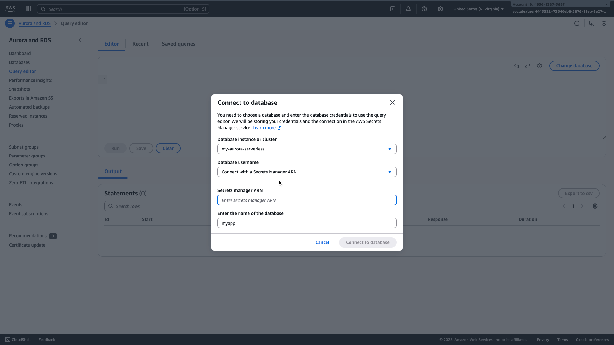
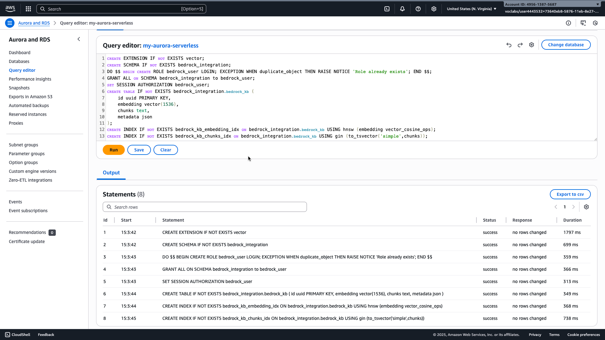

# AWS AI Engineering Project

This guide provides instructions for deploying a generative AI application on AWS. You will use Terraform Cloud to build the infrastructure, create a knowledge base in Amazon Bedrock, and build a Python application to query the knowledge base and generate responses.

## Prerequisites

Before you begin, ensure you have the following installed and configured:

- **AWS CLI:** Configured with your AWS credentials for your target account.
- **Terraform:** Version 1.0.0 or later.
- **Python:** Version 3.8 or later.
- **Git & GitHub Account:** To store your code and connect to Terraform Cloud.

---

## Step 1: Initial Setup

Clone the project repository to your local machine.

```bash
git clone <your-repo-url>
cd <project-root-directory>
```

---

## Step 2: Infrastructure Deployment with Terraform Cloud

We will use the VCS-driven (Version Control System) workflow in Terraform Cloud. This is the standard practice and bypasses local machine issues by running Terraform in a stable, managed environment.

### 2.1: Create Terraform Cloud Workspaces

You need two separate workspaces to manage the two stacks of your project.

1.  **Sign up:** Create a free [Terraform Cloud](https://app.terraform.io/signup/account) account and create an organization.
2.  **Connect to VCS:** Connect your Terraform Cloud organization to your Git provider (e.g., GitHub).

3.  **Create Workspace for Stack 1:**

    - Create a new workspace named `aws-bedrock-project` (or a similar name).
    - Link it to your project's GitHub repository.
    - In the workspace settings (**Settings -> General**), set the **Terraform Working Directory** to: `stack1`

4.  **Create Workspace for Stack 2:**
    - Create another new workspace named `aws-bedrock-project-stack2`.
    - Link it to the **same** GitHub repository.
    - In this workspace's settings, set the **Terraform Working Directory** to: `stack2`

### 2.2: Configure Workspace Variables

In **both** workspaces (`aws-bedrock-project` and `aws-bedrock-project-stack2`), you must add your AWS credentials.

1.  Navigate to your workspace's **Variables** tab.
2.  Add the following under the **Environment Variables** section. Mark the secret values as **"Sensitive"**.

| Key                     | Value                                                              |
| :---------------------- | :----------------------------------------------------------------- |
| `AWS_ACCESS_KEY_ID`     | Your AWS Access Key ID                                             |
| `AWS_SECRET_ACCESS_KEY` | Your AWS Secret Access Key                                         |
| `AWS_SESSION_TOKEN`     | Your AWS Session Token (if using temporary credentials) (optional) |

### 2.3: Deploy the Infrastructure

The deployment is a two-step process managed entirely through the Terraform Cloud UI.

1.  **Push Your Code:** Commit and push your latest code changes to your Git repository. This automatically triggers new plans in both of your workspaces.

2.  **Deploy Stack 1:**

        - Go to your `aws-bedrock-project` (stack1) workspace in Terraform Cloud.
        - Wait for the plan to finish or trigger a "new run" from the UI.
        - Review the proposed changes.
        - Click **"Confirm & Apply"** and wait for the apply to complete successfully.

    

3.  **Prepare Your Aurora PostgreSQL Database" before running terraform plan/apply again for stack2.**

```bash
    stack1's aurora_serverless module automatically creates and manages the AWS Secrets Manager secret for your Aurora
    database credentials. Therefore, you do not need to manually store them.
```

- Go to the Amazon RDS Console
  - Open your web browser and navigate to the AWS Management Console.
  - Search for "RDS" and select the service.
- Locate Your Aurora Serverless Cluster
  - In the RDS dashboard, click on "Databases" in the left navigation pane.
  - Find your Aurora Serverless PostgreSQL cluster (likely named my-aurora-serverless or similar). Click its name to view details.
- Open the Query Editor
  - On the cluster details page, find and click the "Query editor" button or tab.
  - If prompted, you may need to set up a database connection.
- Connect to Your Database
  - In the Query Editor connection prompt/modal:
  - Database instance or cluster: Select your Aurora PostgreSQL cluster from the dropdown list.
  - Database username: Use AWS Secret Manager.
  - Secret Manager ARN: Enter Secret ARN.
  - Database name: Enter myapp. #Change to fit your use case.
  - Click "Connect" or "Connect to database".
  - 
- Get the SQL Script Content

  - The following SQL commands need to be executed:

  ```sql
      CREATE EXTENSION IF NOT EXISTS vector;
      CREATE SCHEMA IF NOT EXISTS bedrock_integration;
      DO $$ BEGIN CREATE ROLE bedrock_user LOGIN; EXCEPTION WHEN duplicate_object THEN RAISE NOTICE 'Role already exists'; END $$;
      GRANT ALL ON SCHEMA bedrock_integration to bedrock_user;
      SET SESSION AUTHORIZATION bedrock_user;
      CREATE TABLE IF NOT EXISTS bedrock_integration.bedrock_kb (
      id uuid PRIMARY KEY,
      embedding vector(1536),
      chunks text,
      metadata json
      );
      CREATE INDEX IF NOT EXISTS bedrock_kb_embedding_idx ON bedrock_integration.bedrock_kb USING hnsw (embedding vector_cosine_ops);
      CREATE INDEX IF NOT EXISTS bedrock_kb_chunks_idx ON bedrock_integration.bedrock_kb USING gin (to_tsvector('simple',
      chunks));
  ```

- Execute the SQL Commands
  In the RDS Query Editor, paste the entire SQL content from Step 5 into the query input area.
  Click the "Run" or "Execute" button.
  Confirm that the editor shows a message indicating the queries were executed successfully.
- Verify Table Creation (Optional)
  Run a simple query to confirm the new table exists:

  ```sql
      SELECT \* FROM bedrock_integration.bedrock_kb LIMIT 1;
  ```

- 

```
If the table exists, you will see column headers or an empty result set. If you see an error like "relation does not exist," the script in Step above did not run correctly.

Once you have successfully executed the SQL script and confirmed the table exists, you can proceed to re-run terraform apply for Stack 2. The Bedrock Knowledge Base creation should now succeed as the required table structure will be present in the database.
```

4.  **Deploy Stack 2:**
    - **After Stack 1 is complete**, go to your `aws-bedrock-project-stack2` workspace.
    - A plan should have already run. It will show that it is reading data from the `stack1` workspace.
    - Review the plan and click **"Confirm & Apply"**.
    - If the plan is not already ongoing, just initiate/trigger a "new run" from the terraform cloud UI


## step 3 Post-Deloyment Steps

### 0. Install Python Dependencies

Before running any Python scripts, ensure all necessary dependencies are installed:

```bash
pip install -r requirements.txt
```

Now that your infrastructure is provisioned, follow these steps to prepare your data and run the chat application.

### 1. Prepare and Upload Documents to S3

The `upload_to_s3.py` script uploads your documents to the S3 bucket created by Stack 1, which will then be ingested by the Bedrock Knowledge Base.

1.  **Place Your Documents**: Put all your PDF specification sheets (or other relevant documents) into the `spec-sheets/` folder:
    ```
    project-root/
    └── scripts/
        └── spec-sheets/
            ├── your-document-1.pdf
            └── your-document-2.pdf
    ```
2.  **Update S3 Bucket Name in Script**: Open `scripts/upload_s3.py` and update the `bucket_name` variable with the actual name of the S3 bucket provisioned by Stack 1.
3.  **Run the Upload Script**: Execute the script from your terminal:
    ```bash
        cd scripts
        python upload_s3.py / python3 upload_s3.py #depending on the version installed
    ```

### 2. Sync Bedrock Knowledge Base Data Source

After uploading your documents to S3, you need to sync the Bedrock Knowledge Base to ingest them.

1.  **Navigate to Bedrock Console**: Go to the AWS Management Console and search for "Bedrock".
2.  **Select Knowledge Bases**: In the Bedrock console, click on "Knowledge bases" in the left navigation pane.
3.  **Choose Your Knowledge Base**: Select your provisioned knowledge base (e.g., `my-bedrock-kb`).
4.  **Sync Data Source**: Go to the "Data sources" tab, select your data source, and click the "Sync" button. Monitor the status until it shows "Active".

### 3. Run the Chat Application

Once the knowledge base has successfully synced and ingested your documents, you can run the Streamlit chat application.

1.  **Run the App**: Execute the Streamlit application from your terminal:
    ```bash
    streamlit run app.py
    ```
    This will open the chat application in your web browser, allowing you to interact with your Bedrock Knowledge Base.

## Complete chat app

### Complete invoke model and knoweldge base code

- Open the bedrock_utils.py file and the following functions:
  - query_knowledge_base
  - generate_response

### Complete the prompt validation function

- Open the bedrock_utils.py file and the following function:

  - valid_prompt

  Hint: categorize the user prompt

## Step 3: S3 Data Upload & Sync

Upload PDF documents to S3 and sync with your Bedrock Knowledge Base.

1.  Place your PDF files in `spec-sheets/`.
2.  Update `scripts/upload_s3.py` with your actual S3 bucket name (you can find this in the outputs of your `stack1` Terraform run).
3.  Run the upload script:
    ```bash
    python3 scripts/upload_s3.py
    ```
4.  In the **Amazon Bedrock console**, navigate to your knowledge base, select the data source, and click **"Sync"**.

_Save a screenshot of the successful data sync from the AWS Console._

---

## Step 4: Python Integration and Application

Implement the functions in `bedrock_utils.py` and run the Streamlit application.

### 4.1: Implement Utility Functions

Complete the functions in `bedrock_utils.py` as described in the file's comments. This includes `query_knowledge_base`, `generate_response`, and `valid_prompt`.

### 4.2: Run the Streamlit App

1.  Ensure you have Streamlit installed:
    ```bash
    pip install streamlit
    ```
2.  Navigate to the directory containing `app.py` and run:
    ```bash
    streamlit run app.py
    ```
3.  Your browser will open to the chat application. Interact with it to test your full solution.

---

## Step 5: Model Parameters Explanation

Create a document named `temperature_top_p_explanation.pdf` or `.docx`. In 1–2 paragraphs, explain how `temperature` and `top_p` affect the creativity, randomness, and diversity of large language model responses.

---

## Step 6: Final Checklist & Submission

- Create a `Screenshots/` folder and add all required screenshots.
- Ensure all code files are present and complete.
- Include the `temperature_top_p_explanation` document.
- Zip the entire project directory as `LastName_FirstName_ProjectSubmission.zip`.
